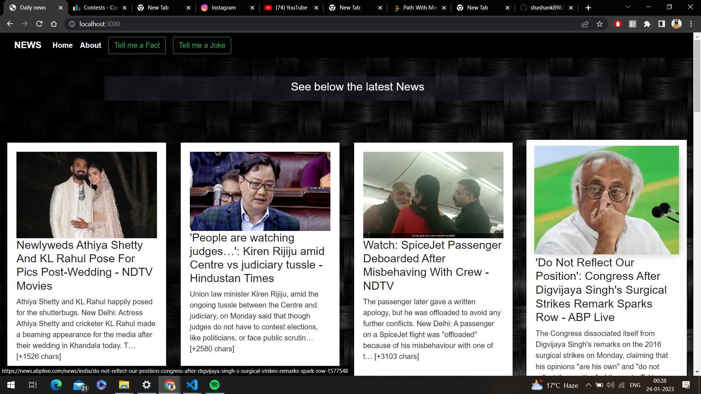
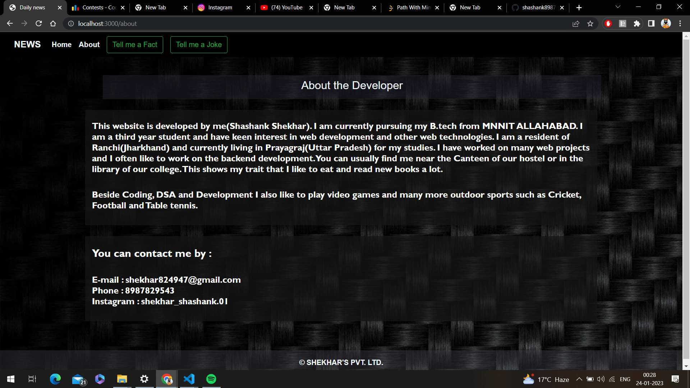
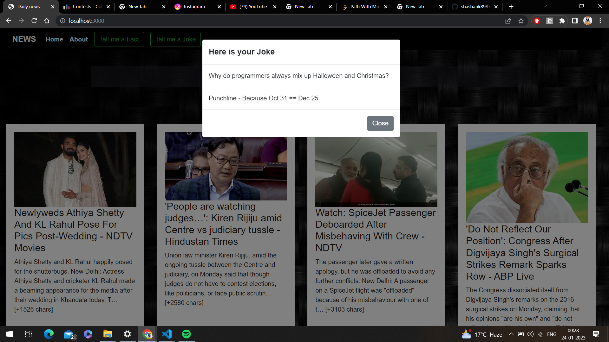
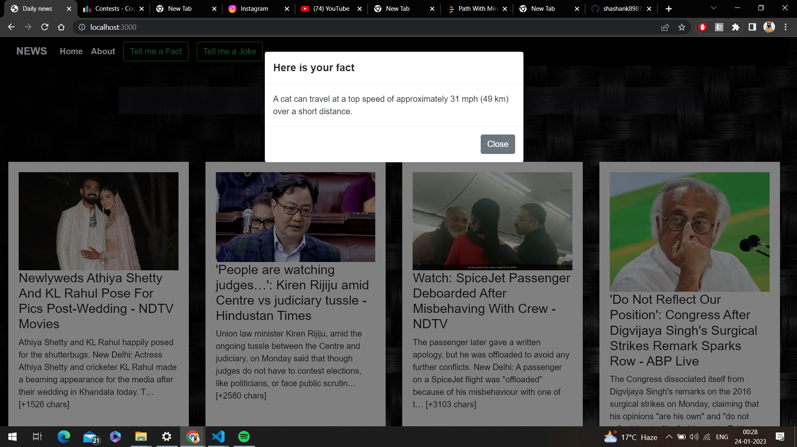

# NEWS

## Introduction:
- NEWS is an online website where you can get the access of the latest news regularly.

- It has other features such as you can get access to variety of jokes and facts by a single click of a button.

- By clicking on Joke button a new joke appear everytime on a modal.

- By clicking on fact button a new fact appear everytime on a modal.

## Technology Stack:
  1) Node.JS
  2) CSS
  3) BootStrap
  4) Javascript
  5) Express
  6) API's 
  7) EJS
  
## Screenshots

 
